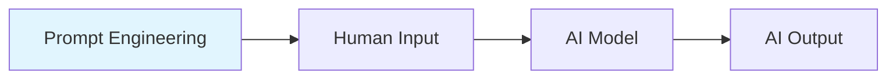
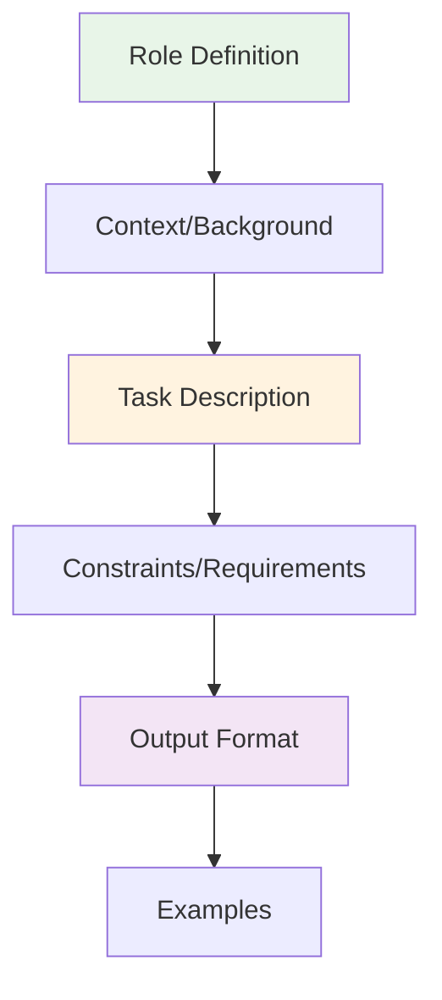

# Prompt Engineering: Complete Step-by-Step Guide

## 🎯 Table of Contents

1. [Introduction to Prompt Engineering](#introduction)
2. [Basic Prompt Structure](#basic-structure)
3. [Prompt Components](#components)
4. [Step-by-Step Learning Path](#learning-path)
5. [Advanced Techniques](#advanced-techniques)
6. [Best Practices](#best-practices)
7. [Common Mistakes](#mistakes)
8. [Real-World Applications](#applications)
9. [Tools and Resources](#tools)

## Introduction to Prompt Engineering <a name="introduction"></a>

Prompt engineering is the art and science of crafting effective inputs to get the best possible outputs from AI language models. It's like learning to "speak AI" fluently.

### What is Prompt Engineering?



**Key Concepts:**
- **Prompt**: The input text you give to an AI model
- **Engineering**: Systematic approach to crafting effective prompts
- **Context**: Providing relevant information to guide the AI
- **Constraints**: Setting boundaries for the AI's response

### Why Learn Prompt Engineering?

1. **Better Results**: Get more accurate and useful responses
2. **Cost Efficiency**: Reduce API calls and token usage
3. **Consistency**: Create reliable, repeatable outputs
4. **Control**: Guide AI behavior and output format
5. **Innovation**: Unlock new AI capabilities

## Basic Prompt Structure <a name="basic-structure"></a>

### The Anatomy of a Good Prompt



### Basic Template:

```
[ROLE] You are a [specific role/expertise]

[CONTEXT] [relevant background information]

[TASK] [what you want the AI to do]

[CONSTRAINTS] [limitations or requirements]

[FORMAT] [how you want the output structured]

[EXAMPLES] [sample inputs/outputs if needed]
```

## Prompt Components <a name="components"></a>

### 1. Role Definition
**Purpose**: Tell the AI who it should be

**Examples:**
```
✅ Good: "You are an expert Python developer with 10 years of experience"
❌ Bad: "Write some code"
```

### 2. Context/Background
**Purpose**: Provide relevant information

**Examples:**
```
✅ Good: "The user is a beginner learning Python for data analysis"
❌ Bad: "Write a program"
```

### 3. Task Description
**Purpose**: Clearly state what you want

**Examples:**
```
✅ Good: "Create a function that calculates the average of a list of numbers"
❌ Bad: "Do something with numbers"
```

### 4. Constraints
**Purpose**: Set boundaries and requirements

**Examples:**
```
✅ Good: "Use only built-in Python functions, no external libraries"
❌ Bad: "Make it work"
```

### 5. Output Format
**Purpose**: Specify how you want the response structured

**Examples:**
```
✅ Good: "Provide the code with comments explaining each line"
❌ Bad: "Give me the answer"
```

## Step-by-Step Learning Path <a name="learning-path"></a>

### Level 1: Foundation (Beginner)

#### Step 1: Basic Instructions
**Goal**: Learn to give clear, simple instructions

**Example:**
```
Write a Python function that adds two numbers.
```

**Exercise**: Try these variations:
- Add error handling
- Include input validation
- Add documentation

#### Step 2: Role-Based Prompts
**Goal**: Understand how role definition affects output

**Example:**
```
You are a math teacher explaining to a 10-year-old student.
Explain how to add two numbers.
```

**Exercise**: Try different roles:
- Expert programmer
- Beginner teacher
- Technical writer

#### Step 3: Context Addition
**Goal**: Learn to provide relevant background

**Example:**
```
You are a Python tutor. The student is learning about functions for the first time.
Create a simple function that calculates the area of a rectangle.
Include comments explaining each part.
```

### Level 2: Intermediate

#### Step 4: Output Formatting
**Goal**: Control how the AI structures its response

**Example:**
```
You are a coding instructor. Create a Python function to find the maximum number in a list.

Format your response as follows:
1. Function definition with comments
2. Example usage
3. Explanation of how it works
4. Common mistakes to avoid
```

#### Step 5: Constraints and Requirements
**Goal**: Set boundaries for AI responses

**Example:**
```
You are a Python expert. Write a function to sort a list.

Requirements:
- Use only built-in Python functions
- Handle empty lists gracefully
- Include type hints
- Maximum 10 lines of code
- No external libraries
```

#### Step 6: Examples and Few-Shot Learning
**Goal**: Use examples to guide AI behavior

**Example:**
```
You are a Python code reviewer. Review this code and suggest improvements.

Example of good feedback:
Code: def add(a, b): return a + b
Feedback: 
- Add type hints: def add(a: int, b: int) -> int
- Add docstring explaining purpose
- Consider edge cases (None values)

Now review this code:
[your code here]
```

### Level 3: Advanced

#### Step 7: Chain-of-Thought Prompts
**Goal**: Make AI show its reasoning process

**Example:**
```
You are a math tutor. Solve this problem step by step, showing your reasoning:

Problem: If a train travels 120 km in 2 hours, what is its average speed?

Please:
1. Identify what you need to find
2. Recall the relevant formula
3. Substitute the values
4. Calculate step by step
5. Provide the answer with units
```

#### Step 8: Conditional Logic
**Goal**: Create prompts that adapt based on conditions

**Example:**
```
You are a coding assistant. Help with this Python problem.

If the user is a beginner:
- Explain each concept in simple terms
- Provide more examples
- Include common mistakes

If the user is advanced:
- Focus on optimization
- Discuss best practices
- Suggest alternative approaches

The user's level: [beginner/advanced]
Problem: [describe the problem]
```

#### Step 9: Iterative Refinement
**Goal**: Improve prompts through iteration

**Example:**
```
First attempt: "Write a Python function"
Refinement: "Write a Python function that handles edge cases"
Better: "Write a Python function that handles edge cases and includes error handling"
Best: "Write a Python function that handles edge cases, includes error handling, and follows PEP 8 style guidelines"
```

## Advanced Techniques <a name="advanced-techniques"></a>

### 1. System Messages vs User Messages

**System Message** (sets behavior):
```
You are a helpful coding assistant. Always provide clear, well-documented code with explanations.
```

**User Message** (specific request):
```
Create a function to calculate the factorial of a number.
```

### 2. Temperature and Creativity Control

**Low Temperature** (focused, consistent):
```
Temperature: 0.1
"Write a technical documentation for this API endpoint"
```

**High Temperature** (creative, varied):
```
Temperature: 0.9
"Write a creative story about a programmer debugging code"
```

### 3. Prompt Chaining

**Step 1**: Generate outline
```
Create an outline for a tutorial on Python decorators
```

**Step 2**: Expand sections
```
Using this outline, expand section 2 with detailed examples
```

**Step 3**: Review and refine
```
Review this content and suggest improvements for clarity
```

### 4. Meta-Prompts

**Example**:
```
You are a prompt engineering expert. Help me create a better prompt for this task:

Current prompt: "Write some code"
Task: Create a Python function to validate email addresses

Suggest improvements to make the prompt more effective.
```

## Best Practices <a name="best-practices"></a>

### 1. Be Specific and Clear

```
✅ Good: "Create a Python function that validates email addresses using regex"
❌ Bad: "Write some code for emails"
```

### 2. Provide Context

```
✅ Good: "You are helping a beginner programmer who is learning about functions"
❌ Bad: "Write a function"
```

### 3. Set Clear Constraints

```
✅ Good: "Use only built-in Python libraries, maximum 20 lines"
❌ Bad: "Make it work somehow"
```

### 4. Specify Output Format

```
✅ Good: "Provide the code with comments, then explain how it works"
❌ Bad: "Give me the answer"
```

### 5. Use Examples

```
✅ Good: "Like this example: def greet(name): return f'Hello {name}'"
❌ Bad: "Write a greeting function"
```

### 6. Iterate and Refine

```
✅ Good: Start simple, then add complexity based on results
❌ Bad: Write a complex prompt without testing
```

## Common Mistakes <a name="mistakes"></a>

### 1. Vague Instructions

```
❌ Bad: "Help me with coding"
✅ Good: "Help me create a Python function to sort a list of dictionaries by a specific key"
```

### 2. Missing Context

```
❌ Bad: "Write a function"
✅ Good: "Write a function for a beginner learning Python, with detailed comments"
```

### 3. Unrealistic Expectations

```
❌ Bad: "Write a complete web application in one response"
✅ Good: "Create the basic structure for a web application, then we'll build it step by step"
```

### 4. Ignoring Output Format

```
❌ Bad: "Tell me about machine learning"
✅ Good: "Explain machine learning in 3 bullet points, then provide 2 examples"
```

### 5. Not Testing Prompts

```
❌ Bad: Write a complex prompt without testing it
✅ Good: Start simple, test, then refine based on results
```

## Real-World Applications <a name="applications"></a>

### 1. Content Creation

**Blog Writing**:
```
You are a technical writer. Create a blog post about Python decorators.

Requirements:
- Target audience: Intermediate Python developers
- Include practical examples
- 800-1000 words
- Include code snippets with explanations
- End with a practical exercise
```

### 2. Code Generation

**API Development**:
```
You are a senior Python developer. Create a REST API endpoint for user authentication.

Requirements:
- Use FastAPI framework
- Include input validation
- Handle errors gracefully
- Include JWT token generation
- Follow security best practices
- Include unit tests
```

### 3. Data Analysis

**Data Processing**:
```
You are a data scientist. Analyze this dataset and provide insights.

Dataset: [describe your data]
Requirements:
- Identify key patterns
- Suggest visualizations
- Highlight anomalies
- Provide actionable recommendations
- Use Python with pandas and matplotlib
```

### 4. Learning and Education

**Tutorial Creation**:
```
You are an experienced programming instructor. Create a tutorial for beginners learning Python.

Topic: [specific topic]
Requirements:
- Start with basic concepts
- Include hands-on exercises
- Provide step-by-step explanations
- Include common mistakes to avoid
- End with a project to practice
```

## Tools and Resources <a name="tools"></a>

### 1. Prompt Testing Tools

- **OpenAI Playground**: Test prompts with different models
- **Anthropic Claude Console**: Experiment with Claude
- **Google Colab**: Test prompts programmatically
- **LangChain**: Build complex prompt chains

### 2. Prompt Libraries

- **Awesome Prompts**: Collection of effective prompts
- **PromptBase**: Marketplace for prompts
- **GitHub**: Community prompt repositories

### 3. Learning Resources

- **OpenAI Documentation**: Official prompt engineering guide
- **Anthropic Constitutional AI**: Safety-focused prompting
- **Academic Papers**: Research on prompt engineering

### 4. Practice Platforms

- **ChatGPT**: Practice with GPT models
- **Claude**: Experiment with different approaches
- **Local Models**: Test with open-source models

## Exercises and Practice

### Beginner Exercises

1. **Basic Instructions**
   - Write a prompt to create a simple calculator
   - Refine it to include error handling
   - Add user interface considerations

2. **Role-Based Prompts**
   - Create prompts for different expert roles
   - Compare outputs from different perspectives
   - Practice switching between roles

3. **Context Addition**
   - Start with a basic prompt
   - Add relevant context step by step
   - Observe how context improves results

### Intermediate Exercises

1. **Output Formatting**
   - Practice specifying different output formats
   - Create prompts for structured data
   - Experiment with creative vs technical formats

2. **Constraint Setting**
   - Practice setting different types of constraints
   - Balance flexibility with specificity
   - Learn to handle edge cases

3. **Example Usage**
   - Create few-shot learning prompts
   - Practice with different example types
   - Learn to choose effective examples

### Advanced Exercises

1. **Prompt Chaining**
   - Create multi-step prompt workflows
   - Practice iterative refinement
   - Build complex prompt systems

2. **Meta-Prompting**
   - Practice creating prompts about prompts
   - Learn to analyze and improve prompts
   - Develop prompt engineering expertise

3. **Real-World Projects**
   - Apply prompt engineering to actual projects
   - Build complete applications using prompts
   - Document your prompt engineering process

## Conclusion

Prompt engineering is a skill that improves with practice. Start with simple prompts and gradually add complexity. Remember to:

1. **Test and iterate** on your prompts
2. **Learn from failures** and successes
3. **Stay updated** with new techniques
4. **Practice regularly** with different types of tasks
5. **Share and learn** from the community

### Next Steps

1. Start with the basic exercises in this guide
2. Practice with real-world problems
3. Experiment with different AI models
4. Join prompt engineering communities
5. Contribute to the field

---

**Happy Prompt Engineering! 🚀**

*Remember: The best prompt is the one that gets you the results you need.*

```markdown:prompt_engineering/01_basic_prompts.md
# Basic Prompt Engineering - Level 1

## 🎯 Learning Objectives
- Understand the fundamental structure of prompts
- Learn to write clear, specific instructions
- Practice basic prompt techniques

##  Core Concepts

### What is a Prompt?
A prompt is the input text you give to an AI model to get a desired output. Think of it as giving instructions to a very smart assistant.

### Basic Prompt Structure
```
[What you want the AI to do]
[How you want it done]
[What format you want the result in]
```

## 🏋️ Exercises

### Exercise 1: Simple Instructions

**Task**: Write a prompt to create a Python function

**Basic Prompt**:
```
Write a Python function that adds two numbers.
```

**Improved Prompt**:
```
Create a Python function that adds two numbers together.
The function should:
- Take two parameters (a and b)
- Return their sum
- Include a docstring explaining what it does
- Handle the case where inputs might not be numbers
```

**Your Turn**: Try writing a prompt for creating a function that multiplies two numbers.

### Exercise 2: Role-Based Prompts

**Task**: Get help with a math problem

**Basic Prompt**:
```
What is 15% of 200?
```

**Role-Based Prompt**:
```
You are a math teacher explaining to a 10-year-old student.
Explain how to calculate 15% of 200 in simple terms.
Use everyday examples they can relate to.
```

**Your Turn**: Write a role-based prompt for explaining photosynthesis to a high school student.

### Exercise 3: Adding Context

**Task**: Get help with Python coding

**Basic Prompt**:
```
Write a Python program.
```

**Context-Enhanced Prompt**:
```
I'm a beginner learning Python for the first time.
I want to create a simple program that asks for a user's name and prints a greeting.
Please explain each line of code so I can understand what's happening.
```

**Your Turn**: Add context to a prompt about learning to cook.

## 🎯 Practice Examples

### Example 1: Writing Prompts for Different Audiences

**For a Beginner**:
```
You are a patient coding instructor teaching Python to someone who has never programmed before.
Create a simple program that calculates the area of a rectangle.
Explain each concept as if you're talking to a complete beginner.
```

**For an Intermediate Learner**:
```
You are a Python mentor helping someone who knows basic programming concepts.
Create a function to calculate the area of a rectangle.
Include error handling and input validation.
Use type hints and follow PEP 8 style guidelines.
```

**For an Expert**:
```
You are a senior Python developer reviewing code for a production system.
Create an optimized function to calculate rectangle areas.
Consider edge cases, performance, and maintainability.
Include comprehensive tests and documentation.
```

### Example 2: Progressive Prompt Improvement

**Version 1** (Basic):
```
Write a story.
```

**Version 2** (Better):
```
Write a short story about a robot learning to paint.
```

**Version 3** (Even Better):
```
Write a 300-word story about a robot learning to paint.
The story should be heartwarming and suitable for children.
Include dialogue and descriptive language.
End with a meaningful lesson about creativity.
```

**Version 4** (Best):
```
You are a children's book author.
Write a 300-word story about a robot named Pixel who learns to paint.
The story should:
- Be heartwarming and suitable for ages 6-10
- Include dialogue between Pixel and their human friend
- Use descriptive language to paint pictures in the reader's mind
- End with a lesson about how everyone can be creative
- Use simple vocabulary appropriate for young readers
```

## 🧪 Interactive Practice

### Practice 1: Email Writing
Write prompts for these scenarios:

1. **Professional email to a colleague**
2. **Friendly email to a friend**
3. **Formal email to a client**

### Practice 2: Problem Solving
Write prompts for these tasks:

1. **Debugging a simple Python error**
2. **Planning a weekend trip**
3. **Learning a new skill**

### Practice 3: Content Creation
Write prompts for:

1. **A blog post about healthy eating**
2. **A social media post about a new product**
3. **A technical tutorial**

## 📝 Homework Assignment

### Assignment 1: Prompt Comparison
Write three different prompts for the same task:
- A basic prompt
- An improved prompt with context
- An expert-level prompt with specific requirements

**Task**: Create a Python function to check if a number is prime.

### Assignment 2: Role Experimentation
Choose a topic and write prompts from three different perspectives:
- A beginner's perspective
- An expert's perspective
- A teacher's perspective

**Topic**: Explain how the internet works.

### Assignment 3: Context Addition
Start with a simple prompt and gradually add context to improve it.

**Starting Prompt**: "Write a recipe."

## 🎯 Key Takeaways

1. **Be Specific**: Vague prompts get vague results
2. **Add Context**: Help the AI understand your situation
3. **Define Roles**: Tell the AI who it should be
4. **Iterate**: Start simple, then improve based on results
5. **Practice**: The more you practice, the better you get

## 🚀 Next Steps

After completing these exercises:
1. Move to Level 2: Intermediate Prompts
2. Practice with real AI models
3. Experiment with different prompt styles
4. Start building your prompt library

---

**Remember**: Every expert was once a beginner. Start simple and build up your skills gradually!

```markdown:prompt_engineering/02_intermediate_prompts.md
# Intermediate Prompt Engineering - Level 2

## 🎯 Learning Objectives
- Master output formatting techniques
- Learn to set effective constraints
- Understand few-shot learning
- Practice iterative prompt refinement

## 📚 Advanced Concepts

### Output Formatting
Controlling how the AI structures its response is crucial for getting usable results.

### Constraints and Requirements
Setting clear boundaries helps the AI focus and produce better results.

### Few-Shot Learning
Providing examples helps the AI understand your expectations.

## 🏋️ Exercises

### Exercise 1: Output Formatting

**Task**: Get information about Python functions

**Basic Prompt**:
```
Tell me about Python functions.
```

**Formatted Prompt**:
```
You are a Python instructor. Explain Python functions to a beginner.

Format your response as follows:

1. **What is a function?** (2-3 sentences)
2. **Basic syntax** (with code example)
3. **Common use cases** (3 examples)
4. **Best practices** (3 tips)
5. **Common mistakes** (2 to avoid)

Keep each section concise and beginner-friendly.
```

**Your Turn**: Write a formatted prompt for explaining loops in Python.

### Exercise 2: Setting Constraints

**Task**: Create a simple calculator

**Unconstrained Prompt**:
```
Create a calculator.
```

**Constrained Prompt**:
```
You are a Python developer. Create a simple calculator with these requirements:

Constraints:
- Use only built-in Python functions
- Maximum 50 lines of code
- Handle basic operations: +, -, *, /
- Include input validation
- No external libraries
- Follow PEP 8 style guidelines
- Include error handling for division by zero

Output format:
1. Complete code with comments
2. Example usage
3. Brief explanation of how it works
```

**Your Turn**: Write a constrained prompt for creating a to-do list application.

### Exercise 3: Few-Shot Learning

**Task**: Create a function to format names

**Without Examples**:
```
Create a function that formats a person's name.
```

**With Examples**:
```
You are a Python developer. Create a function that formats a person's name.

Examples:
Input: "john doe"
Output: "John Doe"

Input: "MARY JANE"
Output: "Mary Jane"

Input: "robert smith jr"
Output: "Robert Smith Jr"

Create a function that follows this same pattern.
Include error handling for invalid inputs.
```

**Your Turn**: Create a few-shot prompt for a function that converts temperatures.

## 🎯 Advanced Techniques

### Technique 1: Chain-of-Thought Prompts

**Purpose**: Make the AI show its reasoning process

**Example**:
```
You are a math tutor. Solve this problem step by step:

Problem: A train travels 300 km in 4 hours. What is its average speed?

Please show your work:
1. What are we trying to find?
2. What formula should we use?
3. What values do we have?
4. How do we calculate it?
5. What is the final answer with units?
```

### Technique 2: Conditional Prompts

**Purpose**: Adapt the response based on conditions

**Example**:
```
You are a coding assistant helping with Python.

If the user is a beginner:
- Explain each concept in simple terms
- Provide more examples
- Include common mistakes to avoid
- Use analogies when helpful

If the user is advanced:
- Focus on optimization and best practices
- Discuss edge cases and error handling
- Suggest alternative approaches
- Include performance considerations

User level: [beginner/advanced]
Task: [describe the task]
```

### Technique 3: Iterative Refinement

**Purpose**: Improve prompts through multiple iterations

**Example**:
```
Iteration 1: "Write a Python function"
Iteration 2: "Write a Python function that handles errors"
Iteration 3: "Write a Python function that handles errors and includes documentation"
Iteration 4: "Write a Python function that handles errors, includes documentation, and follows PEP 8"
```

##  Practice Scenarios

### Scenario 1: Technical Documentation

**Task**: Create API documentation

**Prompt**:
```
You are a technical writer creating API documentation.

Create documentation for a user authentication endpoint with these requirements:

Format:
1. **Endpoint**: URL and HTTP method
2. **Description**: What it does
3. **Parameters**: Required and optional fields
4. **Request Example**: Sample JSON
5. **Response Example**: Success and error responses
6. **Error Codes**: Common error scenarios
7. **Usage Notes**: Important considerations

Constraints:
- Use clear, professional language
- Include realistic examples
- Follow REST API documentation standards
- Keep it concise but complete
```

### Scenario 2: Code Review

**Task**: Review Python code

**Prompt**:
```
You are a senior Python developer conducting a code review.

Review this code and provide feedback:

[Code to review]

Provide feedback in this format:

**Strengths** (2-3 points)
**Issues Found** (list with severity: Critical/High/Medium/Low)
**Suggestions for Improvement** (specific recommendations)
**Security Considerations** (if applicable)
**Performance Notes** (if applicable)

Be constructive and specific in your feedback.
```

### Scenario 3: Learning Material Creation

**Task**: Create a tutorial

**Prompt**:
```
You are an experienced programming instructor creating a tutorial.

Create a tutorial on [topic] with these requirements:

Structure:
1. **Introduction** (what and why)
2. **Prerequisites** (what to know beforehand)
3. **Step-by-step guide** (with code examples)
4. **Common pitfalls** (mistakes to avoid)
5. **Practice exercises** (hands-on activities)
6. **Summary** (key takeaways)

Constraints:
- Target audience: [beginner/intermediate/advanced]
- Length: [specify word count or time]
- Include code examples
- Make it interactive and engaging
- Provide real-world context
```

##  Advanced Exercises

### Exercise 1: Multi-Step Prompts

**Task**: Create a complete web application

**Step 1**: Planning
```
You are a software architect. Plan a simple web application for [purpose].
Create a high-level design with:
- Main features
- Technology stack
- Database schema
- API endpoints
- User interface components
```

**Step 2**: Implementation
```
Using the plan from step 1, create the backend API for this web application.
Focus on the core functionality first.
Include proper error handling and validation.
```

**Step 3**: Testing
```
Create comprehensive tests for the web application we've built.
Include unit tests, integration tests, and user acceptance tests.
```

### Exercise 2: Meta-Prompting

**Task**: Improve a prompt

**Prompt**:
```
You are a prompt engineering expert. Analyze and improve this prompt:

[Original prompt]

Provide:
1. **Analysis**: What's good and what needs improvement
2. **Improved version**: Your enhanced prompt
3. **Explanation**: Why your changes make it better
4. **Alternative approaches**: Other ways to structure it
```

### Exercise 3: Context Switching

**Task**: Adapt content for different audiences

**Prompt**:
```
You are a content creator. Adapt this technical content for different audiences:

[Original content]

Create versions for:
1. **Technical experts**: Detailed, advanced concepts
2. **Business stakeholders**: High-level benefits and ROI
3. **End users**: Simple, practical usage
4. **Students**: Educational, with explanations

Each version should maintain the core message while being appropriate for the audience.
```

## 📝 Advanced Assignments

### Assignment 1: Prompt Chain
Create a 3-step prompt chain for building a complete application:
1. Requirements gathering
2. Design and architecture
3. Implementation and testing

### Assignment 2: Multi-Modal Prompt
Create a prompt that generates both text and structured data (like JSON or tables).

### Assignment 3: Adaptive Prompt
Create a prompt that changes its approach based on the user's skill level or preferences.

## 🎯 Key Takeaways

1. **Format Matters**: Structure your prompts for better results
2. **Constraints Help**: Set boundaries to focus the AI
3. **Examples Work**: Use few-shot learning for complex tasks
4. **Iterate Always**: Start simple, then refine
5. **Think Ahead**: Plan your prompt strategy

## 🚀 Next Steps

After completing these exercises:
1. Move to Level 3: Advanced Techniques
2. Practice with real AI models
3. Build complex prompt systems
4. Experiment with different AI platforms

---

**Remember**: Intermediate skills come from practice and experimentation. Don't be afraid to try new approaches!

```markdown:prompt_engineering/03_advanced_prompts.md
# Advanced Prompt Engineering - Level 3

## 🎯 Learning Objectives
- Master complex prompt techniques
- Learn prompt chaining and workflows
- Understand system vs user messages
- Create production-ready prompts

## 📚 Expert Concepts

### Prompt Chaining
Creating multi-step workflows where each prompt builds on the previous one.

### System vs User Messages
Understanding how different message types affect AI behavior.

### Temperature and Creativity Control
Managing the balance between consistency and creativity.

## 🏋️ Advanced Exercises

### Exercise 1: Prompt Chaining

**Task**: Create a complete software project

**Chain Step 1 - Planning**:
```
You are a software architect. Plan a task management application.

Create a comprehensive plan including:
- Feature requirements
- Technology stack
- Database design
- API structure
- User interface mockups
- Development timeline
```

**Chain Step 2 - Architecture**:
```
Based on the plan from step 1, create the detailed technical architecture.

Include:
- Database schema with relationships
- API endpoint specifications
- Component structure
- Security considerations
- Performance requirements
```

**Chain Step 3 - Implementation**:
```
Using the architecture from step 2, implement the core backend functionality.

Focus on:
- User authentication system
- Task CRUD operations
- Database models
- API endpoints
- Error handling
```

**Chain Step 4 - Testing**:
```
Create comprehensive tests for the application we've built.

Include:
- Unit tests for each component
- Integration tests for API endpoints
- User acceptance tests
- Performance tests
- Security tests
```

### Exercise 2: System vs User Messages

**System Message** (sets behavior):
```
You are an expert Python developer with 15 years of experience.
You specialize in web development, data science, and system architecture.
Always provide production-ready code with comprehensive error handling.
Include detailed comments and follow best practices.
Be concise but thorough in explanations.
```

**User Message** (specific request):
```
Create a REST API for user management with the following features:
- User registration and login
- Password reset functionality
- User profile management
- Role-based access control
- JWT token authentication
```

### Exercise 3: Temperature Control

**Low Temperature (0.1) - Focused and Consistent**:
```
Temperature: 0.1
You are a technical writer creating API documentation.
Write clear, consistent documentation for a user authentication endpoint.
Use standard technical writing conventions.
Be precise and avoid creative language.
```

**High Temperature (0.9) - Creative and Varied**:
```
Temperature: 0.9
You are a creative storyteller.
Write an engaging story about a programmer debugging a mysterious bug.
Make it entertaining and include unexpected plot twists.
Use vivid descriptions and creative language.
```

## 🎯 Advanced Techniques

### Technique 1: Meta-Prompting

**Purpose**: Create prompts about prompts

**Example**:
```
You are a prompt engineering expert with 10 years of experience.

Analyze this prompt and provide improvements:

[Original prompt]

Provide:
1. **Strengths**: What works well
2. **Weaknesses**: What could be improved
3. **Specific improvements**: Detailed suggestions
4. **Alternative approaches**: Different ways to structure it
5. **Best practices**: How it aligns with prompt engineering principles
```

### Technique 2: Conditional Logic

**Purpose**: Create adaptive prompts

**Example**:
```
You are a coding assistant. Help with this programming problem.

Context: [user's skill level and background]
Problem: [specific programming challenge]

If the user is a beginner:
- Explain concepts in simple terms
- Provide step-by-step guidance
- Include many examples
- Focus on understanding over optimization

If the user is intermediate:
- Balance explanation with practical implementation
- Include best practices
- Discuss trade-offs
- Suggest learning resources

If the user is advanced:
- Focus on optimization and edge cases
- Discuss architectural considerations
- Include performance analysis
- Suggest advanced techniques

Adapt your response based on the user's level.
```

### Technique 3: Iterative Refinement

**Purpose**: Continuously improve prompts

**Example**:
```
Iteration 1: Basic prompt
"Write a Python function"

Iteration 2: Add specificity
"Write a Python function to calculate factorial"

Iteration 3: Add constraints
"Write a Python function to calculate factorial using recursion only"

Iteration 4: Add error handling
"Write a Python function to calculate factorial with input validation and error handling"

Iteration 5: Add documentation
"Write a Python function to calculate factorial with comprehensive documentation and examples"

Iteration 6: Add testing
"Write a Python function to calculate factorial with unit tests and edge case handling"
```

## 🧪 Complex Scenarios

### Scenario 1: Multi-Modal Content Creation

**Task**: Create a complete tutorial with code, explanations, and visuals

**Prompt**:
```
You are a technical content creator. Create a comprehensive tutorial on [topic].

Requirements:
1. **Introduction**: Clear overview and learning objectives
2. **Prerequisites**: What readers need to know
3. **Step-by-step guide**: Detailed instructions with code examples
4. **Visual aids**: Describe diagrams, charts, or screenshots needed
5. **Common issues**: Troubleshooting section
6. **Practice exercises**: Hands-on activities
7. **Summary**: Key takeaways and next steps

Format:
- Use markdown formatting
- Include code blocks with syntax highlighting
- Structure with clear headings
- Add callout boxes for important notes
- Include a table of contents

Constraints:
- Target audience: [specify level]
- Length: [word count]
- Include real-world examples
- Make it interactive and engaging
```

### Scenario 2: Code Review and Refactoring

**Task**: Comprehensive code analysis and improvement

**Prompt**:
```
You are a senior software engineer conducting a comprehensive code review.

Review this codebase:

[Code to review]

Provide analysis in this format:

**Code Quality Assessment**
- Overall structure and organization
- Readability and maintainability
- Code complexity analysis
- Potential technical debt

**Security Analysis**
- Security vulnerabilities
- Input validation issues
- Authentication/authorization concerns
- Data protection considerations

**Performance Review**
- Bottlenecks and inefficiencies
- Resource usage optimization
- Scalability considerations
- Caching opportunities

**Best Practices Compliance**
- Coding standards adherence
- Design pattern usage
- Error handling quality
- Documentation completeness

**Refactoring Recommendations**
- Specific improvements with code examples
- Priority levels (High/Medium/Low)
- Implementation effort estimates
- Risk assessment

**Testing Strategy**
- Test coverage analysis
- Missing test scenarios
- Test quality improvements
- Automated testing suggestions
```

### Scenario 3: Problem-Solving Workflow

**Task**: Systematic approach to complex problems

**Prompt**:
```
You are a problem-solving expert. Help solve this complex problem:

[Problem description]

Follow this systematic approach:

**Phase 1: Problem Analysis**
1. Break down the problem into components
2. Identify root causes and contributing factors
3. Define success criteria and constraints
4. Assess available resources and limitations

**Phase 2: Solution Design**
1. Generate multiple solution approaches
2. Evaluate each approach against criteria
3. Select the best approach with justification
4. Create detailed implementation plan

**Phase 3: Implementation Strategy**
1. Define step-by-step execution plan
2. Identify potential risks and mitigation strategies
3. Set up monitoring and validation methods
4. Plan for iteration and improvement

**Phase 4: Validation and Testing**
1. Define testing criteria and methods
2. Create validation checkpoints
3. Plan for feedback collection
4. Establish success metrics

Provide detailed guidance for each phase.
```

##  Expert Exercises

### Exercise 1: Multi-Agent Simulation

**Task**: Create a system with multiple AI agents

**Prompt**:
```
You are orchestrating a team of AI agents for a software development project.

Create prompts for each team member:

**Product Manager Agent**:
[Prompt for requirements gathering and project planning]

**Architect Agent**:
[Prompt for system design and architecture]

**Developer Agent**:
[Prompt for implementation and coding]

**Tester Agent**:
[Prompt for testing and quality assurance]

**DevOps Agent**:
[Prompt for deployment and operations]

Each agent should have:
- Clear role definition
- Specific responsibilities
- Communication protocols
- Decision-making authority
- Collaboration guidelines
```

### Exercise 2: Adaptive Learning System

**Task**: Create a prompt that adapts to user progress

**Prompt**:
```
You are an adaptive learning system for [subject].

Track the user's progress and adjust your teaching approach:

**Assessment Phase**:
- Evaluate current knowledge level
- Identify knowledge gaps
- Determine learning style preferences
- Set personalized learning objectives

**Adaptive Teaching**:
- Adjust content complexity based on performance
- Provide additional examples for struggling concepts
- Accelerate learning for advanced topics
- Offer alternative explanations when needed

**Progress Monitoring**:
- Track learning milestones
- Identify areas needing reinforcement
- Suggest next learning steps
- Provide motivation and encouragement

**Feedback Loop**:
- Collect user feedback on teaching effectiveness
- Adjust teaching methods based on feedback
- Continuously improve the learning experience
- Maintain engagement and motivation
```

### Exercise 3: Creative Problem Solving

**Task**: Generate innovative solutions

**Prompt**:
```
You are a creative problem-solving expert. Help solve this challenge:

[Challenge description]

Use creative thinking techniques:

**Divergent Thinking**:
- Generate 20+ different solution approaches
- Think outside conventional boundaries
- Combine unrelated concepts
- Explore unconventional perspectives

**Convergent Thinking**:
- Evaluate and rank all solutions
- Identify the most promising approaches
- Combine elements from multiple solutions
- Create hybrid approaches

**Innovation Framework**:
- Apply design thinking principles
- Use lateral thinking techniques
- Incorporate systems thinking
- Apply TRIZ methodology

**Implementation Planning**:
- Create detailed action plans
- Identify resource requirements
- Plan for experimentation and iteration
- Design success metrics
```

##  Expert Assignments

### Assignment 1: Prompt Engineering Framework
Create a comprehensive framework for prompt engineering that includes:
- Methodology for prompt design
- Evaluation criteria
- Iteration processes
- Quality assurance methods

### Assignment 2: Multi-Modal Prompt System
Design a prompt system that generates:
- Text content
- Structured data
- Code
- Visual descriptions
- Interactive elements

### Assignment 3: Adaptive AI Assistant
Create a prompt system for an AI assistant that:
- Learns from user interactions
- Adapts to user preferences
- Provides personalized responses
- Maintains context across sessions

## 🎯 Key Takeaways

1. **Complexity Management**: Break down complex tasks into manageable steps
2. **Adaptive Systems**: Create prompts that respond to user needs
3. **Quality Assurance**: Build in validation and testing
4. **Continuous Improvement**: Always iterate and refine
5. **Systematic Approach**: Use structured methodologies

## 🚀 Next Steps

After completing these exercises:
1. Apply techniques to real-world projects
2. Build production prompt systems
3. Contribute to the prompt engineering community
4. Stay updated with latest developments

---

**Remember**: Advanced prompt engineering is about creating systems, not just individual prompts. Think big and build systematically!

```markdown:prompt_engineering/04_practical_examples.md
# Practical Prompt Engineering Examples

## 🎯 Real-World Applications

This section provides practical examples you can use immediately in your work and projects.

## 📚 Content Creation Examples

### Example 1: Blog Post Writing

**Prompt**:
```
You are a technical writer creating a blog post about Python decorators.

Create a comprehensive blog post with these requirements:

**Structure**:
1. Engaging introduction that hooks the reader
2. Clear explanation of what decorators are
3. Step-by-step examples with code
4. Real-world use cases
5. Common pitfalls and how to avoid them
6. Best practices and tips
7. Conclusion with next steps

**Style**:
- Target audience: Intermediate Python developers
- Tone: Friendly and educational
- Length: 1500-2000 words
- Include code examples with explanations
- Use analogies to explain complex concepts

**Format**:
- Use markdown formatting
- Include syntax-highlighted code blocks
- Add callout boxes for important tips
- Include a table of contents
```

### Example 2: Social Media Content

**Prompt**:
```
You are a social media manager for a tech company.

Create engaging social media posts about our new AI-powered code review tool.

**Requirements**:
- Create 5 different posts for different platforms
- Platforms: LinkedIn, Twitter, Instagram, Facebook
- Tone: Professional but approachable
- Include relevant hashtags
- Add call-to-action where appropriate

**Post Types**:
1. Product announcement
2. Feature highlight
3. Customer testimonial
4. Educational tip
5. Behind-the-scenes

**Constraints**:
- Keep each post under platform character limits
- Include relevant emojis and formatting
- Make content shareable and engaging
```

### Example 3: Technical Documentation

**Prompt**:
```
You are a technical writer creating API documentation.

Document this user authentication endpoint:

**Endpoint**: POST /api/auth/login
**Purpose**: Authenticate user and return access token

**Documentation Requirements**:
1. **Overview**: What the endpoint does
2. **Request Format**: Headers, body parameters, data types
3. **Response Format**: Success and error responses
4. **Authentication**: Required credentials
5. **Rate Limiting**: Any limitations
6. **Error Codes**: All possible error responses
7. **Examples**: Request/response examples in multiple languages
8. **Security Notes**: Important security considerations

**Format**:
- Use clear, professional language
- Include realistic examples
- Follow REST API documentation standards
- Add code snippets for common programming languages
```

## 💻 Programming Examples

### Example 1: Code Generation

**Prompt**:
```
You are a senior Python developer. Create a production-ready function for user authentication.

**Requirements**:
- Function name: authenticate_user
- Parameters: username (str), password (str)
- Return: dict with user info and token, or None if failed
- Include comprehensive error handling
- Use bcrypt for password hashing
- Implement JWT token generation
- Add input validation
- Include logging for security events
- Follow PEP 8 style guidelines

**Code Structure**:
1. Function definition with type hints
2. Input validation
3. Database query for user
4. Password verification
5. Token generation
6. Error handling
7. Logging
8. Return statement

**Include**:
- Complete function code
- Example usage
- Unit tests
- Security considerations
```

### Example 2: Code Review

**Prompt**:
```
You are a senior software engineer conducting a code review.

Review this Python function for a production environment:

[Code to review]

**Review Criteria**:
1. **Functionality**: Does it work correctly?
2. **Security**: Any security vulnerabilities?
3. **Performance**: Efficiency and optimization opportunities
4. **Maintainability**: Code quality and readability
5. **Error Handling**: Proper exception management
6. **Testing**: Test coverage and edge cases
7. **Documentation**: Code comments and docstrings
8. **Best Practices**: Adherence to coding standards

**Provide**:
- Detailed analysis of each criterion
- Specific improvement suggestions
- Code examples for fixes
- Priority levels for issues (Critical/High/Medium/Low)
- Overall assessment and recommendations
```

### Example 3: Debugging Help

**Prompt**:
```
You are a debugging expert. Help me fix this Python error:

[Error message and code]

**Debugging Process**:
1. **Error Analysis**: What does the error mean?
2. **Root Cause**: What's causing the problem?
3. **Solution**: How to fix it?
4. **Prevention**: How to avoid this in the future?

**Provide**:
- Clear explanation of the error
- Step-by-step solution
- Fixed code example
- Explanation of why the fix works
- Tips for debugging similar issues
- Best practices to prevent this error
```

## 📊 Data Analysis Examples

### Example 1: Data Cleaning

**Prompt**:
```
You are a data scientist. Help me clean this dataset:

[Dataset description and issues]

**Data Cleaning Tasks**:
1. **Missing Values**: Identify and handle missing data
2. **Outliers**: Detect and treat outliers
3. **Data Types**: Ensure correct data types
4. **Duplicates**: Remove duplicate records
5. **Consistency**: Check for data consistency
6. **Validation**: Validate data quality

**Provide**:
- Python code for each cleaning step
- Explanation of each technique used
- Before/after data quality metrics
- Recommendations for data validation
- Best practices for data cleaning
```

### Example 2: Data Visualization

**Prompt**:
```
You are a data visualization expert. Create compelling visualizations for this dataset:

[Dataset description and analysis goals]

**Visualization Requirements**:
1. **Exploratory Analysis**: Key insights and patterns
2. **Distribution Plots**: Understand data distributions
3. **Correlation Analysis**: Relationships between variables
4. **Trend Analysis**: Time-based patterns (if applicable)
5. **Comparative Analysis**: Compare different groups/categories
6. **Int 