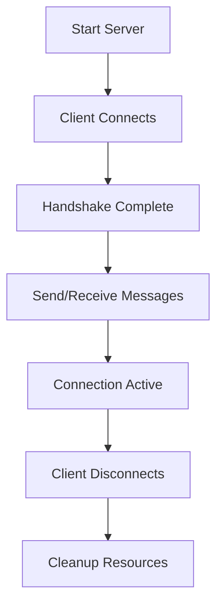

# WebSocket Quick Start Guide

## 🚀 Get Started in 5 Minutes

### 1. Setup Environment
```bash
# Install dependencies
python setup.py

# Or manually install
pip install -r requirements.txt
```

### 2. Run Your First WebSocket
```bash
# Terminal 1: Start server
python 01_basic_server.py

# Terminal 2: Run client
python 02_basic_client.py
```

### 3. Try the Chat Application
```bash
# Terminal 1: Start chat server
python 03_chat_server.py

# Terminal 2 & 3: Run multiple clients
python 04_chat_client.py
```

## 🎯 Example Workflow



## 🎯 Common Commands

| Command | Description |
|---------|-------------|
| `python 01_basic_server.py` | Basic echo server |
| `python 02_basic_client.py` | Basic echo client |
| `python 03_chat_server.py` | Chat server |
| `python 04_chat_client.py` | Chat client |
| `python 05_data_streaming_server.py` | Data streaming server |
| `python 06_data_streaming_client.py` | Data streaming client |
| `python 07_authenticated_server.py` | Authenticated server |
| `python 08_authenticated_client.py` | Authenticated client |

## 🐛 Troubleshooting

### Connection Refused?
- Make sure server is running first
- Check if port 8765 is available
- Try different port if needed

### Import Errors?
- Run `pip install -r requirements.txt`
- Check Python version (3.7+ required)

### Authentication Failed?
- Use username: `admin`, password: `password123`
- Or username: `user1`, password: `userpass`

## 📚 Next Steps

1. Read the full `README.md` for detailed explanations
2. Try modifying the examples
3. Build your own WebSocket application
4. Explore advanced features like SSL/TLS

---

**Need help?** Check the main `README.md` for comprehensive documentation! 