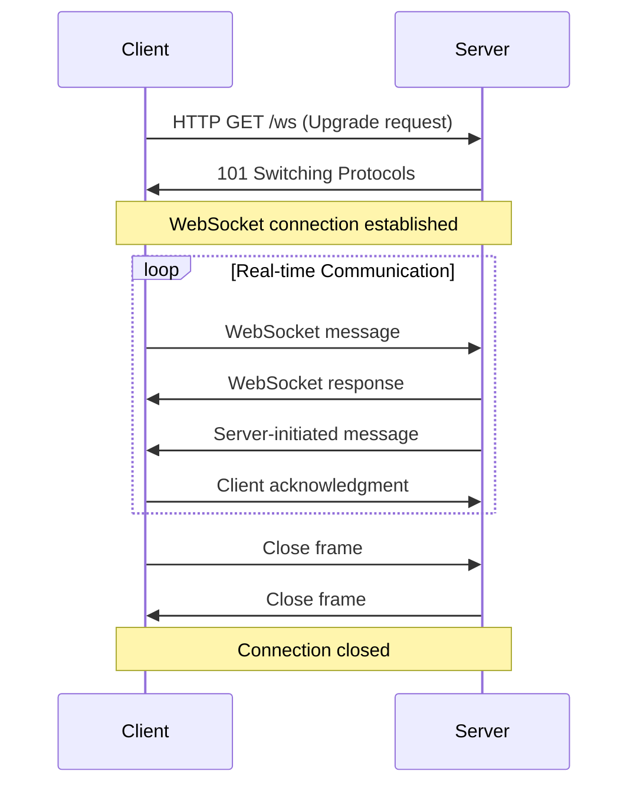
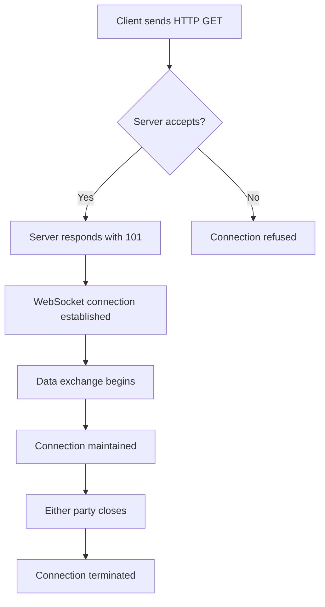

# WebSockets in Python - Complete Step-by-Step Tutorial

## Table of Contents
1. [Introduction to WebSockets](#introduction)
2. [WebSocket Architecture](#architecture)
3. [Prerequisites](#prerequisites)
4. [Step-by-Step Implementation](#step-by-step)
5. [Examples](#examples)
6. [Best Practices](#best-practices)
7. [Troubleshooting](#troubleshooting)

## Introduction <a name="introduction"></a>

WebSockets provide a persistent, bidirectional communication channel between a client and server over a single TCP connection. Unlike traditional HTTP requests, WebSockets allow real-time data exchange without the overhead of repeated HTTP handshakes.

### Key Benefits:
- **Real-time Communication**: Instant data transfer
- **Bidirectional**: Both client and server can send messages
- **Efficient**: Single connection for multiple messages
- **Low Latency**: Minimal overhead after initial handshake

## WebSocket Architecture <a name="architecture"></a>



### WebSocket Handshake Process:



## Prerequisites <a name="prerequisites"></a>

### Required Packages:
```bash
pip install websockets
pip install asyncio
pip install aiohttp  # For HTTP server integration
```

### Python Version:
- Python 3.7+ (for async/await support)

## Step-by-Step Implementation <a name="step-by-step"></a>

### Step 1: Basic WebSocket Server

```python:web_sockets/01_basic_server.py
import asyncio
import websockets
import json

# Store connected clients
connected_clients = set()

async def handle_client(websocket, path):
    """Handle individual client connections"""
    # Add client to connected set
    connected_clients.add(websocket)
    print(f"Client connected. Total clients: {len(connected_clients)}")
    
    try:
        async for message in websocket:
            # Echo the message back to the client
            response = {
                "type": "echo",
                "message": message,
                "timestamp": asyncio.get_event_loop().time()
            }
            await websocket.send(json.dumps(response))
            print(f"Echoed message: {message}")
            
    except websockets.exceptions.ConnectionClosed:
        print("Client disconnected")
    finally:
        # Remove client from connected set
        connected_clients.remove(websocket)
        print(f"Client disconnected. Total clients: {len(connected_clients)}")

async def main():
    """Start the WebSocket server"""
    server = await websockets.serve(
        handle_client, 
        "localhost", 
        8765
    )
    print("WebSocket server started on ws://localhost:8765")
    await server.wait_closed()

if __name__ == "__main__":
    asyncio.run(main())
```

### Step 2: Basic WebSocket Client

```python:web_sockets/02_basic_client.py
import asyncio
import websockets
import json

async def client():
    """Basic WebSocket client"""
    uri = "ws://localhost:8765"
    
    try:
        async with websockets.connect(uri) as websocket:
            print("Connected to WebSocket server")
            
            # Send a test message
            message = "Hello, WebSocket!"
            await websocket.send(message)
            print(f"Sent: {message}")
            
            # Receive response
            response = await websocket.recv()
            data = json.loads(response)
            print(f"Received: {data}")
            
    except websockets.exceptions.ConnectionRefused:
        print("Could not connect to WebSocket server")
    except Exception as e:
        print(f"Error: {e}")

if __name__ == "__main__":
    asyncio.run(client())
```

### Step 3: Chat Application

```python:web_sockets/03_chat_server.py
import asyncio
import websockets
import json
from datetime import datetime

# Store connected clients with their names
clients = {}

async def broadcast(message, sender=None):
    """Broadcast message to all connected clients"""
    if clients:
        # Create message to send
        broadcast_msg = {
            "type": "message",
            "sender": sender,
            "message": message,
            "timestamp": datetime.now().isoformat(),
            "clients_count": len(clients)
        }
        
        # Send to all clients except sender
        disconnected_clients = []
        for websocket, client_name in clients.items():
            try:
                if websocket != sender:
                    await websocket.send(json.dumps(broadcast_msg))
            except websockets.exceptions.ConnectionClosed:
                disconnected_clients.append(websocket)
        
        # Clean up disconnected clients
        for websocket in disconnected_clients:
            del clients[websocket]

async def handle_chat_client(websocket, path):
    """Handle chat client connections"""
    client_name = None
    
    try:
        # Get client name
        name_message = await websocket.recv()
        name_data = json.loads(name_message)
        client_name = name_data.get("name", f"User{len(clients) + 1}")
        
        # Add client to dictionary
        clients[websocket] = client_name
        print(f"{client_name} joined the chat. Total users: {len(clients)}")
        
        # Notify others about new user
        await broadcast(f"{client_name} joined the chat!", websocket)
        
        # Send welcome message
        welcome_msg = {
            "type": "system",
            "message": f"Welcome {client_name}! You are now connected.",
            "timestamp": datetime.now().isoformat()
        }
        await websocket.send(json.dumps(welcome_msg))
        
        # Handle incoming messages
        async for message in websocket:
            try:
                data = json.loads(message)
                if data.get("type") == "message":
                    await broadcast(data["message"], websocket)
                    print(f"{client_name}: {data['message']}")
            except json.JSONDecodeError:
                # Handle plain text messages
                await broadcast(message, websocket)
                print(f"{client_name}: {message}")
                
    except websockets.exceptions.ConnectionClosed:
        print(f"{client_name} disconnected")
    finally:
        if websocket in clients:
            client_name = clients[websocket]
            del clients[websocket]
            await broadcast(f"{client_name} left the chat!", websocket)
            print(f"{client_name} left. Total users: {len(clients)}")

async def main():
    """Start the chat server"""
    server = await websockets.serve(
        handle_chat_client, 
        "localhost", 
        8765
    )
    print("Chat server started on ws://localhost:8765")
    await server.wait_closed()

if __name__ == "__main__":
    asyncio.run(main())
```

### Step 4: Chat Client

```python:web_sockets/04_chat_client.py
import asyncio
import websockets
import json
import aioconsole

async def chat_client():
    """Interactive chat client"""
    uri = "ws://localhost:8765"
    
    try:
        async with websockets.connect(uri) as websocket:
            print("Connected to chat server!")
            
            # Get user name
            name = await aioconsole.ainput("Enter your name: ")
            name_msg = {
                "type": "join",
                "name": name
            }
            await websocket.send(json.dumps(name_msg))
            
            # Create tasks for sending and receiving messages
            async def receive_messages():
                """Receive and display messages"""
                try:
                    async for message in websocket:
                        data = json.loads(message)
                        if data["type"] == "message":
                            sender = data.get("sender", "Unknown")
                            print(f"\n{sender}: {data['message']}")
                        elif data["type"] == "system":
                            print(f"\n[System] {data['message']}")
                        print(f"\n{name}: ", end="", flush=True)
                except websockets.exceptions.ConnectionClosed:
                    print("\nConnection closed by server")
                except Exception as e:
                    print(f"\nError receiving message: {e}")
            
            async def send_messages():
                """Send user messages"""
                try:
                    while True:
                        message = await aioconsole.ainput(f"{name}: ")
                        if message.lower() in ['quit', 'exit', 'bye']:
                            break
                        
                        msg_data = {
                            "type": "message",
                            "message": message
                        }
                        await websocket.send(json.dumps(msg_data))
                except Exception as e:
                    print(f"Error sending message: {e}")
            
            # Run both tasks concurrently
            receive_task = asyncio.create_task(receive_messages())
            send_task = asyncio.create_task(send_messages())
            
            # Wait for either task to complete
            done, pending = await asyncio.wait(
                [receive_task, send_task],
                return_when=asyncio.FIRST_COMPLETED
            )
            
            # Cancel pending tasks
            for task in pending:
                task.cancel()
                
    except websockets.exceptions.ConnectionRefused:
        print("Could not connect to chat server")
    except Exception as e:
        print(f"Error: {e}")

if __name__ == "__main__":
    asyncio.run(chat_client())
```

### Step 5: Real-time Data Streaming

```python:web_sockets/05_data_streaming_server.py
import asyncio
import websockets
import json
import random
import time
from datetime import datetime

# Store connected clients
streaming_clients = set()

async def generate_sensor_data():
    """Generate simulated sensor data"""
    return {
        "temperature": round(random.uniform(20, 30), 2),
        "humidity": round(random.uniform(40, 80), 2),
        "pressure": round(random.uniform(1000, 1020), 2),
        "timestamp": datetime.now().isoformat()
    }

async def stream_data():
    """Stream data to all connected clients"""
    while True:
        if streaming_clients:
            data = await generate_sensor_data()
            message = {
                "type": "sensor_data",
                "data": data
            }
            
            # Send to all connected clients
            disconnected_clients = []
            for websocket in streaming_clients:
                try:
                    await websocket.send(json.dumps(message))
                except websockets.exceptions.ConnectionClosed:
                    disconnected_clients.append(websocket)
            
            # Clean up disconnected clients
            for websocket in disconnected_clients:
                streaming_clients.remove(websocket)
                print(f"Client disconnected. Total clients: {len(streaming_clients)}")
        
        await asyncio.sleep(1)  # Send data every second

async def handle_streaming_client(websocket, path):
    """Handle streaming client connections"""
    streaming_clients.add(websocket)
    print(f"Streaming client connected. Total clients: {len(streaming_clients)}")
    
    try:
        # Send initial connection message
        welcome_msg = {
            "type": "connection",
            "message": "Connected to data stream",
            "timestamp": datetime.now().isoformat()
        }
        await websocket.send(json.dumps(welcome_msg))
        
        # Keep connection alive
        async for message in websocket:
            # Handle any client messages (e.g., configuration)
            try:
                data = json.loads(message)
                if data.get("type") == "config":
                    print(f"Client configuration: {data}")
            except json.JSONDecodeError:
                pass
                
    except websockets.exceptions.ConnectionClosed:
        print("Streaming client disconnected")
    finally:
        streaming_clients.discard(websocket)
        print(f"Streaming client disconnected. Total clients: {len(streaming_clients)}")

async def main():
    """Start the streaming server"""
    # Start the data streaming task
    streaming_task = asyncio.create_task(stream_data())
    
    # Start the WebSocket server
    server = await websockets.serve(
        handle_streaming_client, 
        "localhost", 
        8766
    )
    print("Data streaming server started on ws://localhost:8766")
    
    # Wait for server to close
    await server.wait_closed()
    
    # Cancel streaming task
    streaming_task.cancel()

if __name__ == "__main__":
    asyncio.run(main())
```

### Step 6: Data Streaming Client

```python:web_sockets/06_data_streaming_client.py
import asyncio
import websockets
import json
import matplotlib.pyplot as plt
from collections import deque
import time

class DataVisualizer:
    def __init__(self, max_points=50):
        self.max_points = max_points
        self.timestamps = deque(maxlen=max_points)
        self.temperatures = deque(maxlen=max_points)
        self.humidities = deque(maxlen=max_points)
        self.pressures = deque(maxlen=max_points)
        
        # Setup matplotlib
        plt.ion()  # Interactive mode
        self.fig, (self.ax1, self.ax2, self.ax3) = plt.subplots(3, 1, figsize=(10, 8))
        self.fig.suptitle('Real-time Sensor Data')
        
    def update_plot(self, data):
        """Update the plot with new data"""
        timestamp = time.time()
        
        self.timestamps.append(timestamp)
        self.temperatures.append(data['temperature'])
        self.humidities.append(data['humidity'])
        self.pressures.append(data['pressure'])
        
        # Clear previous plots
        self.ax1.clear()
        self.ax2.clear()
        self.ax3.clear()
        
        # Plot temperature
        self.ax1.plot(list(self.timestamps), list(self.temperatures), 'r-', label='Temperature')
        self.ax1.set_ylabel('Temperature (°C)')
        self.ax1.legend()
        self.ax1.grid(True)
        
        # Plot humidity
        self.ax2.plot(list(self.timestamps), list(self.humidities), 'b-', label='Humidity')
        self.ax2.set_ylabel('Humidity (%)')
        self.ax2.legend()
        self.ax2.grid(True)
        
        # Plot pressure
        self.ax3.plot(list(self.timestamps), list(self.pressures), 'g-', label='Pressure')
        self.ax3.set_ylabel('Pressure (hPa)')
        self.ax3.set_xlabel('Time')
        self.ax3.legend()
        self.ax3.grid(True)
        
        plt.tight_layout()
        plt.pause(0.01)

async def streaming_client():
    """Data streaming client with visualization"""
    uri = "ws://localhost:8766"
    visualizer = DataVisualizer()
    
    try:
        async with websockets.connect(uri) as websocket:
            print("Connected to data streaming server!")
            
            async for message in websocket:
                try:
                    data = json.loads(message)
                    if data["type"] == "sensor_data":
                        sensor_data = data["data"]
                        print(f"Received: {sensor_data}")
                        visualizer.update_plot(sensor_data)
                    elif data["type"] == "connection":
                        print(f"System: {data['message']}")
                        
                except json.JSONDecodeError as e:
                    print(f"Error parsing message: {e}")
                except Exception as e:
                    print(f"Error processing message: {e}")
                    
    except websockets.exceptions.ConnectionRefused:
        print("Could not connect to streaming server")
    except Exception as e:
        print(f"Error: {e}")
    finally:
        plt.ioff()
        plt.show()

if __name__ == "__main__":
    asyncio.run(streaming_client())
```

### Step 7: WebSocket with Authentication

```python:web_sockets/07_authenticated_server.py
import asyncio
import websockets
import json
import jwt
import hashlib
from datetime import datetime, timedelta

# In a real application, use environment variables
SECRET_KEY = "your-secret-key-here"
USERS = {
    "admin": hashlib.sha256("password123".encode()).hexdigest(),
    "user1": hashlib.sha256("userpass".encode()).hexdigest()
}

# Store authenticated clients
authenticated_clients = {}

def create_token(username):
    """Create JWT token for user"""
    payload = {
        "username": username,
        "exp": datetime.utcnow() + timedelta(hours=24)
    }
    return jwt.encode(payload, SECRET_KEY, algorithm="HS256")

def verify_token(token):
    """Verify JWT token"""
    try:
        payload = jwt.decode(token, SECRET_KEY, algorithms=["HS256"])
        return payload["username"]
    except jwt.ExpiredSignatureError:
        return None
    except jwt.InvalidTokenError:
        return None

async def authenticate_client(websocket):
    """Authenticate client connection"""
    try:
        # Wait for authentication message
        auth_message = await asyncio.wait_for(websocket.recv(), timeout=10.0)
        auth_data = json.loads(auth_message)
        
        if auth_data.get("type") != "auth":
            return None
        
        username = auth_data.get("username")
        password = auth_data.get("password")
        
        if not username or not password:
            return None
        
        # Check credentials
        hashed_password = hashlib.sha256(password.encode()).hexdigest()
        if username in USERS and USERS[username] == hashed_password:
            token = create_token(username)
            return username, token
        else:
            return None
            
    except asyncio.TimeoutError:
        return None
    except json.JSONDecodeError:
        return None

async def handle_authenticated_client(websocket, path):
    """Handle authenticated client connections"""
    # Authenticate client
    auth_result = await authenticate_client(websocket)
    
    if not auth_result:
        await websocket.close(1008, "Authentication failed")
        return
    
    username, token = auth_result
    authenticated_clients[websocket] = username
    
    # Send authentication success message
    auth_success = {
        "type": "auth_success",
        "message": f"Welcome {username}!",
        "token": token,
        "timestamp": datetime.now().isoformat()
    }
    await websocket.send(json.dumps(auth_success))
    print(f"User {username} authenticated successfully")
    
    try:
        async for message in websocket:
            try:
                data = json.loads(message)
                
                # Verify token for each message (optional, for extra security)
                if "token" in data:
                    token_username = verify_token(data["token"])
                    if token_username != username:
                        await websocket.send(json.dumps({
                            "type": "error",
                            "message": "Invalid token"
                        }))
                        continue
                
                # Handle different message types
                if data.get("type") == "message":
                    response = {
                        "type": "message_response",
                        "message": f"Received: {data['message']}",
                        "sender": username,
                        "timestamp": datetime.now().isoformat()
                    }
                    await websocket.send(json.dumps(response))
                    
                elif data.get("type") == "private":
                    # Handle private messages
                    target_user = data.get("to")
                    if target_user in authenticated_clients.values():
                        # Find target user's websocket
                        target_websocket = None
                        for ws, user in authenticated_clients.items():
                            if user == target_user:
                                target_websocket = ws
                                break
                        
                        if target_websocket:
                            private_msg = {
                                "type": "private_message",
                                "from": username,
                                "message": data["message"],
                                "timestamp": datetime.now().isoformat()
                            }
                            await target_websocket.send(json.dumps(private_msg))
                    
            except json.JSONDecodeError:
                await websocket.send(json.dumps({
                    "type": "error",
                    "message": "Invalid JSON format"
                }))
                
    except websockets.exceptions.ConnectionClosed:
        print(f"User {username} disconnected")
    finally:
        if websocket in authenticated_clients:
            del authenticated_clients[websocket]
            print(f"User {username} disconnected. Total users: {len(authenticated_clients)}")

async def main():
    """Start the authenticated WebSocket server"""
    server = await websockets.serve(
        handle_authenticated_client, 
        "localhost", 
        8767
    )
    print("Authenticated WebSocket server started on ws://localhost:8767")
    await server.wait_closed()

if __name__ == "__main__":
    asyncio.run(main())
```

### Step 8: Authenticated Client

```python:web_sockets/08_authenticated_client.py
import asyncio
import websockets
import json
import aioconsole

async def authenticated_client():
    """Authenticated WebSocket client"""
    uri = "ws://localhost:8767"
    
    try:
        async with websockets.connect(uri) as websocket:
            print("Connected to authenticated server!")
            
            # Get credentials
            username = await aioconsole.ainput("Username: ")
            password = await aioconsole.ainput("Password: ")
            
            # Send authentication
            auth_msg = {
                "type": "auth",
                "username": username,
                "password": password
            }
            await websocket.send(json.dumps(auth_msg))
            
            # Wait for authentication response
            auth_response = await websocket.recv()
            auth_data = json.loads(auth_response)
            
            if auth_data["type"] == "auth_success":
                print(f"Authentication successful: {auth_data['message']}")
                token = auth_data["token"]
                
                # Start message handling
                async def receive_messages():
                    try:
                        async for message in websocket:
                            data = json.loads(message)
                            if data["type"] == "message_response":
                                print(f"\n[Response] {data['message']}")
                            elif data["type"] == "private_message":
                                print(f"\n[Private from {data['from']}] {data['message']}")
                            elif data["type"] == "error":
                                print(f"\n[Error] {data['message']}")
                            print(f"\n{username}: ", end="", flush=True)
                    except websockets.exceptions.ConnectionClosed:
                        print("\nConnection closed by server")
                    except Exception as e:
                        print(f"\nError receiving message: {e}")
                
                async def send_messages():
                    try:
                        while True:
                            message = await aioconsole.ainput(f"{username}: ")
                            if message.lower() in ['quit', 'exit', 'bye']:
                                break
                            
                            # Check if it's a private message
                            if message.startswith("/private "):
                                parts = message.split(" ", 2)
                                if len(parts) >= 3:
                                    target_user = parts[1]
                                    private_msg = parts[2]
                                    msg_data = {
                                        "type": "private",
                                        "to": target_user,
                                        "message": private_msg,
                                        "token": token
                                    }
                                else:
                                    print("Usage: /private <username> <message>")
                                    continue
                            else:
                                msg_data = {
                                    "type": "message",
                                    "message": message,
                                    "token": token
                                }
                            
                            await websocket.send(json.dumps(msg_data))
                    except Exception as e:
                        print(f"Error sending message: {e}")
                
                # Run both tasks concurrently
                receive_task = asyncio.create_task(receive_messages())
                send_task = asyncio.create_task(send_messages())
                
                # Wait for either task to complete
                done, pending = await asyncio.wait(
                    [receive_task, send_task],
                    return_when=asyncio.FIRST_COMPLETED
                )
                
                # Cancel pending tasks
                for task in pending:
                    task.cancel()
                    
            else:
                print("Authentication failed")
                
    except websockets.exceptions.ConnectionRefused:
        print("Could not connect to authenticated server")
    except Exception as e:
        print(f"Error: {e}")

if __name__ == "__main__":
    asyncio.run(authenticated_client())
```

## Examples <a name="examples"></a>

### Running the Examples:

1. **Basic Echo Server/Client:**
   ```bash
   # Terminal 1: Start server
   python 01_basic_server.py
   
   # Terminal 2: Run client
   python 02_basic_client.py
   ```

2. **Chat Application:**
   ```bash
   # Terminal 1: Start chat server
   python 03_chat_server.py
   
   # Terminal 2 & 3: Run multiple chat clients
   python 04_chat_client.py
   ```

3. **Data Streaming:**
   ```bash
   # Terminal 1: Start streaming server
   python 05_data_streaming_server.py
   
   # Terminal 2: Run streaming client
   python 06_data_streaming_client.py
   ```

4. **Authenticated WebSocket:**
   ```bash
   # Terminal 1: Start authenticated server
   python 07_authenticated_server.py
   
   # Terminal 2: Run authenticated client
   python 08_authenticated_client.py
   ```

## Best Practices <a name="best-practices"></a>

### 1. Error Handling
```python
try:
    async with websockets.connect(uri) as websocket:
        # Your WebSocket code here
        pass
except websockets.exceptions.ConnectionRefused:
    print("Server is not available")
except websockets.exceptions.ConnectionClosed:
    print("Connection was closed")
except Exception as e:
    print(f"Unexpected error: {e}")
```

### 2. Connection Management
```python
# Keep track of connections
connected_clients = set()

async def handle_client(websocket, path):
    connected_clients.add(websocket)
    try:
        # Handle client
        pass
    finally:
        connected_clients.discard(websocket)
```

### 3. Message Validation
```python
async def handle_message(websocket, message):
    try:
        data = json.loads(message)
        if "type" not in data:
            await websocket.send(json.dumps({"error": "Missing message type"}))
            return
        
        # Handle different message types
        if data["type"] == "chat":
            await handle_chat_message(websocket, data)
        elif data["type"] == "status":
            await handle_status_message(websocket, data)
        else:
            await websocket.send(json.dumps({"error": "Unknown message type"}))
            
    except json.JSONDecodeError:
        await websocket.send(json.dumps({"error": "Invalid JSON"}))
```

### 4. Heartbeat Mechanism
```python
async def heartbeat(websocket):
    """Send periodic heartbeat to keep connection alive"""
    while True:
        try:
            await websocket.ping()
            await asyncio.sleep(30)  # Send ping every 30 seconds
        except websockets.exceptions.ConnectionClosed:
            break

async def handle_client(websocket, path):
    # Start heartbeat task
    heartbeat_task = asyncio.create_task(heartbeat(websocket))
    
    try:
        # Handle client messages
        async for message in websocket:
            # Process message
            pass
    finally:
        heartbeat_task.cancel()
```

## Troubleshooting <a name="troubleshooting"></a>

### Common Issues:

1. **Connection Refused:**
   - Ensure server is running before client
   - Check port availability
   - Verify firewall settings

2. **Connection Closed Unexpectedly:**
   - Implement heartbeat mechanism
   - Add proper error handling
   - Check network stability

3. **Message Not Received:**
   - Verify message format
   - Check for JSON parsing errors
   - Ensure proper async/await usage

4. **Performance Issues:**
   - Use connection pooling for multiple clients
   - Implement message queuing
   - Monitor memory usage

### Debug Mode:
```python
import logging

# Enable debug logging
logging.basicConfig(level=logging.DEBUG)
websockets.enableTrace(True)
```

## Advanced Features

### 1. SSL/TLS Support
```python
import ssl

# Create SSL context
ssl_context = ssl.create_default_context(ssl.Purpose.CLIENT_AUTH)
ssl_context.load_cert_chain("cert.pem", "key.pem")

# Start server with SSL
server = await websockets.serve(
    handle_client, 
    "localhost", 
    8765,
    ssl=ssl_context
)
```

### 2. Compression
```python
# Enable compression
server = await websockets.serve(
    handle_client, 
    "localhost", 
    8765,
    compression=None  # or "deflate"
)
```

### 3. Custom Headers
```python
# Client with custom headers
headers = {
    "Authorization": "Bearer token123",
    "User-Agent": "MyWebSocketClient/1.0"
}

async with websockets.connect(uri, extra_headers=headers) as websocket:
    # Your code here
    pass
```

## Conclusion

This tutorial provides a comprehensive guide to implementing WebSockets in Python. From basic echo servers to complex authenticated chat applications, you now have the tools to build real-time communication systems.

### Next Steps:
1. Explore WebSocket libraries like `socketio` for more features
2. Implement WebSocket in web frameworks like FastAPI or Django
3. Add database integration for persistent messaging
4. Implement load balancing for multiple WebSocket servers
5. Add monitoring and analytics for WebSocket connections

### Resources:
- [WebSockets Documentation](https://websockets.readthedocs.io/)
- [MDN WebSocket Guide](https://developer.mozilla.org/en-US/docs/Web/API/WebSockets_API)
- [RFC 6455 - WebSocket Protocol](https://tools.ietf.org/html/rfc6455)

---

**Happy WebSocket Programming! 🚀** 